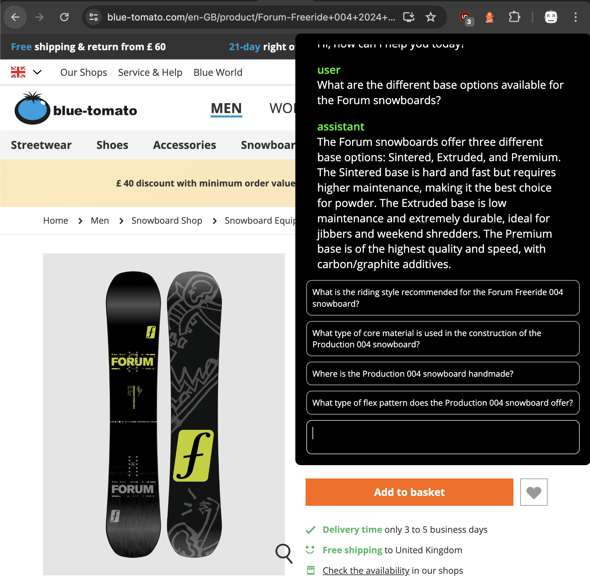

# Generative AI Workshop

This repository contains Jupyter notebooks for the workshop `Generative AI - A whirlwind tour` by [Mario Zechner](https://mariozechner.at).

For **remote or in-person workshop** bookings, please reach out at contact@mariozechner.at.

**Workshop Duration**: Minimum 4 hours, maximum 10 hours.

**Languages**: English or German (Course materials in English only).

**Target Audience**: This workshop is ideal for organizations interested in:

- Understanding the capabilities and limitations of generative AI.
- Learning how to effectively integrate AI into their teams or products.
- Evaluating the validity of AI products and solutions critically.

**Prerequisites**: Basic familiarity with any programming language is beneficial but not required. The workshop is designed to be accessible, with technical concepts explained in a way that everyone can understand.

**Content Overview**:

1. A practical introduction to machine learning and generative large language models, including interactive notebooks.
2. An extensive Q&A session to explore:
   - How to apply these technologies within your organization.
   - The feasibility of specific AI use cases.
   - Assessing third-party AI solutions for effectiveness and validity.

**Key Takeaways**:

- A solid foundation in machine learning with a focus on generative large language models like GPT.
- Strategies for leveraging machine learning in your business.
- Skills to critically evaluate AI solution claims.

**Pricing** is tailored to meet individual or organizational needs.

## Testimonials

> _"Mario hat uns in nur wenigen Stunden einen fundierten Einblick gegeben, wie GenAI funktioniert und wo heute die Möglichkeiten und Grenzen liegen. Der Workshop zielt auf Leute mit Basis SW Entwicklungs-Know How ab und hilft unserem Unternehmen, die AI Strategie besser zu definieren."_
>
> \- Bernhard Reichel, CEO ETM professional control

> "Demystified the "magic" notion of AI and brought it down to earth for us in order to get a more correct idea what it can be useful for."
>
> \- Course participant, ETM professional control

> "Sehr kompetenter Trainer und schonungsloses Aufzeigen von Vor-/Nachteilen der LLMs (=keine Marketingveranstaltung "pro AI")"
>
> \- Course participant, ETM professional control

## License

The contents of this repository are licensed under the [CC BY-NC 4.0 DEED license](https://creativecommons.org/licenses/by-nc/4.0/deed.en).
You are free to **share** and **adapt** the contents of your repository under the following terms:

- **Attribution** — You must give appropriate credit, provide a link to the license, and indicate if changes were made . You may do so in any reasonable manner, but not in any way that suggests the licensor endorses you or your use.
- **NonCommercial** — You may not use the material for commercial purposes.

See the [full license text](https://creativecommons.org/licenses/by-nc/4.0/deed.en) for more information.

## Running the notebooks

You can run the notebooks via [Google Colab](https://colab.research.google.com/), or locally via [Jupyter](https://jupyter.org/).

Some of the notebooks require you to get an OpenAI API key, as well as a Hugging Face API token.

[Sign up for OpenAI (paid)](https://platform.openai.com/signup)

[Sign up for Hugging Face (free)](https://huggingface.co/join)

Click the links below to open each section in Google Colab in your browser.

1. [Supervised Learning](https://colab.research.google.com/github/badlogic/genai-workshop/blob/main/01_supervised_learning.ipynb)
2. [Unsupervised Learning - Clustering](https://colab.research.google.com/github/badlogic/genai-workshop/blob/main/02_unsupervised_learning_clustering.ipynb)
3. [Unsupervised Learning - Embedding](https://colab.research.google.com/github/badlogic/genai-workshop/blob/main/03_unsupervised_learning_embeddings.ipynb)
4. [Unsupervised Learning - Langage Models](https://colab.research.google.com/github/badlogic/genai-workshop/blob/main/04_unsupervised_learning_language_models.ipynb)
5. [Generative AI](https://colab.research.google.com/github/badlogic/genai-workshop/blob/main/05_generative_ai.ipynb)
6. [GPT-4 - State of the Art](https://colab.research.google.com/github/badlogic/genai-workshop/blob/main/06_state_of_the_art.ipynb)
7. [Prompt Engineering](https://colab.research.google.com/github/badlogic/genai-workshop/blob/main/07_prompt_engineering.ipynb)
8. [Retrieval-augmented Generation](https://colab.research.google.com/github/badlogic/genai-workshop/blob/main/08_retrieval_augemented_generation.ipynb)
9. [Simple, effective RAG Implementation](https://colab.research.google.com/github/badlogic/genai-workshop/blob/main/09_simple_rag.ipynb)

## Demo projects

This repository also contains more elaborate projects, that are closer to real-world use cases.

### Product advisor

The "product adviser" uses a simple "grounding" technique as described in the [Prompt Engineering](https://colab.research.google.com/github/badlogic/genai-workshop/blob/main/07_prompt_engineering.ipynb) notebook.

Its task is it, to answer customer questions for a specific product the customer is currently viewing in the webshop of Blue Tomato.

The product advisor is implemented as 2 components:

- [examples/product-advisor/extension/](examples/product-advisor/extension/): a trivial Google Chrome extension, which injects a chat window onto the product page, and allows the user to ask questions about the product. The meat is in `content.js`. When a page is loaded, the extension checks if the viewed URL is that of a product on [blue-tomato.com](blue-tomato.com). If so, it issues a request to the server component (`/create`), which returns an id for the current chat, as well as 5 questions, a user may ask about the product, which are displayed as suggestions. When the user selects a suggested question, or enters their own question, a call to the `/turn` endpoint is issued, sending the server component the chat id and the message the user selected/entered. It then receives the response from the server, which itself gets the answer from OpenAI's API. The returned answer is then rendered in the chat UI.
- [examples/product-advisor/server.py](examples/product-advisor/server.py): the server component. A simple Flask based service. It has two endpoints
  - `/create`: called by the Google Chrome extension when a product page on [blue-tomato.com](blue-tomato.com) is viewed. It receives the URL of the viewed page, extracts its plain text, and creates an in-memory object that keeps track of the chat history for this specific session. The system prompt contains the extracted product page contents, and instructions to answer any question based on that extracted text.
  - `/turn`: called by the Google Chrome extension when the user entered a new message/question. Receives the chat id and the new message. The new message is appeneded to the chat history for that chat id. Then the full chat history plus the system prompt including the product page text and instructions are send to OpenAI's APIs to receive a corresponding answer. The answer is stored in the chat history and returned to the Google Chrome extension.

To run this demo:

- Start the server: `cd examples/product-advisor && ./setup.sh && source venv/bin/activate` to create a Python virtual environment, install the dependencies, and activate the virtual environment for the current terminal session. Then run `python sever.py` to start the server.
- Open the URL `chrome://extensions` in Google Chrome. Click on "Load unpacked" and select the directory `examples/product-advisor/extension`.
- Open the [blue-tomato.com](blue-tomato.com) website and navigate to any product page. Upon loading a product page for the first time, the server fetches its content and extracts the plain text. This can take a little. The chat window will only pop up once the server has done the extraction.
